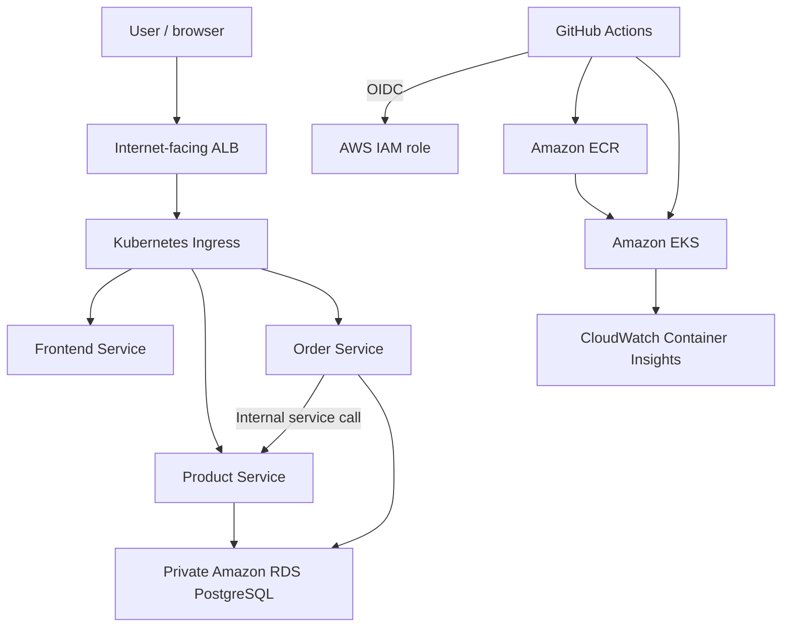

# Architecture and Engineering Decisions

## System overview

The platform is a small e-commerce application composed of three containerized services:

- **Frontend** — a public dashboard exposed through an Application Load Balancer (ALB).
- **Product service** — manages Product records and available stock.
- **Order service** — creates Orders and calls the Product service through the internal Kubernetes network.

Product and Order use PostgreSQL databases hosted in Amazon RDS. The application runs on Amazon EKS. Public HTTP traffic enters through an internet-facing ALB created from the Kubernetes Ingress resource by the AWS Load Balancer Controller.

## Network layout

| Component | Current implementation | Reason |
| --- | --- | --- |
| VPC | `10.0.0.0/16` | Provides the network boundary for EKS, RDS, subnets, route tables, and security groups. |
| Public subnets | Two Availability Zones | Support the internet-facing ALB and currently host EKS worker nodes. |
| Private subnets | Two Availability Zones | Host the RDS DB subnet group. |
| Internet gateway | Public route table sends `0.0.0.0/0` to the gateway | Enables external access to the ALB. |
| RDS security group | PostgreSQL port `5432` allowed only from the VPC CIDR | Keeps database access inside the VPC. |

## Key engineering decisions

| Decision | Why it was chosen | Evidence |
| --- | --- | --- |
| Separate Frontend, Product, and Order services | Separates responsibilities and lets Product and Order scale independently. | Three Kubernetes Deployments and Services. |
| One parameterized Dockerfile | Reuses one container build pattern while a build argument selects the service directory. | `SERVICE_DIR` build argument. |
| Non-root application user | Reduces the privileges available to a compromised container process. | Dockerfile creates `appuser` with UID `10001`. |
| Docker Compose for local validation | Lets another engineer reproduce the full service and database flow before cloud deployment. | Compose service definitions, PostgreSQL health check, and automated local tests. |
| Terraform for AWS infrastructure | Makes cloud infrastructure repeatable, reviewable, and consistent across runs. | Terraform provisions VPC, EKS, ECR, RDS, IAM, and outputs. |
| EKS Deployments and Services | Deployments maintain the desired Pod count; Services provide stable internal discovery. Product and Order can use probes, resource requests/limits, and HPA independently. | Product and Order Deployment, Service, probe, resource, and HPA manifests. |
| ALB Ingress | Provides one public entry point and routes traffic by path to the correct Kubernetes Service. | `/`, `/products`, and `/orders` rules in `ingress.yaml`. |
| Private, encrypted RDS | Keeps the database off the public internet and encrypts data at rest. | Private DB subnets, `publicly_accessible = false`, encrypted storage, and an RDS security group. |
| GitHub Actions with OIDC | GitHub Actions runs the infrastructure and application workflows. It uses OIDC to assume an AWS IAM role, so long-lived AWS keys are not stored in GitHub. | Workflow files, OIDC trust policy, IAM role, and workflow run history. |
| CloudWatch Container Insights | The EKS CloudWatch Observability add-on installs CloudWatch Agent and Fluent Bit. They collect Kubernetes metrics and container logs in CloudWatch. | EKS add-on configuration, Container Insights metrics, and CloudWatch Logs. |
| SonarQube and ECR scanning | SonarQube scans the repository for code-quality and security issues. Amazon ECR scans each pushed image for known vulnerabilities. | SonarQube scan result and ECR scan-on-push findings. |

## Current trade-offs

The project prioritizes a working end-to-end solution within the exercise timebox. EKS worker nodes currently run in public subnets while RDS remains private. Moving worker nodes to private subnets is a priority production-hardening step.

CloudWatch Container Insights provides basic operational logs and metrics. A future enhancement is Prometheus, Grafana, and Alertmanager for more detailed application dashboards and alerts.

