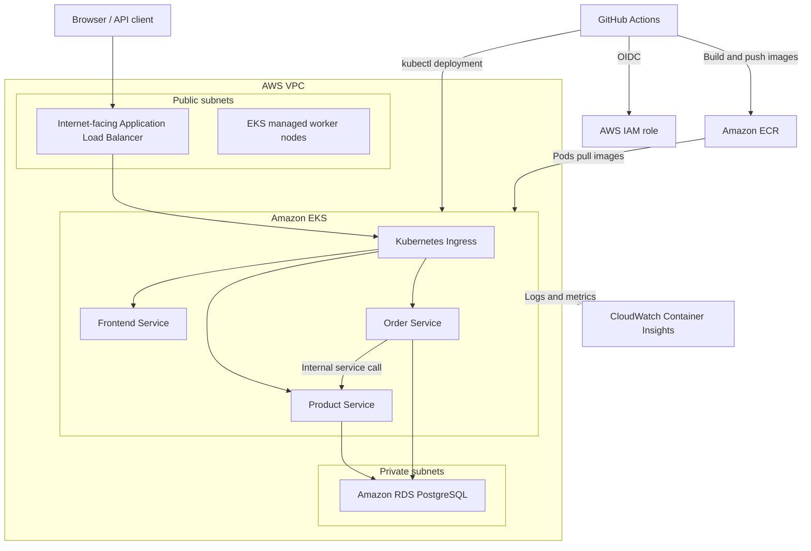

# E-Commerce DevOps Platform

This repository contains a working end-to-end DevOps demonstration for a small e-commerce application.

The application has three containerized services:

* **Frontend** — public web dashboard
* **Product service** — product, price, and stock API
* **Order service** — order API that validates products and updates stock

The services run on Amazon EKS and use a private Amazon RDS PostgreSQL database. Terraform provisions the AWS infrastructure, while GitHub Actions builds, validates, and deploys the application.

## Architecture



## Platform components

| Component                     | Purpose                                                                   |
| ----------------------------- | ------------------------------------------------------------------------- |
| Amazon VPC                    | Network boundary for EKS, RDS, subnets, route tables, and security groups |
| Public subnets                | Host the internet-facing ALB and the current EKS worker nodes             |
| Private subnets               | Host the private RDS PostgreSQL instance                                  |
| Amazon EKS                    | Runs the Kubernetes workloads                                             |
| Amazon ECR                    | Stores Frontend, Product, and Order container images                      |
| Application Load Balancer     | Public entry point with path-based routing through Kubernetes Ingress     |
| Amazon RDS PostgreSQL         | Private database used by Product and Order                                |
| Terraform                     | Provisions and manages AWS infrastructure                                 |
| GitHub Actions                | Runs infrastructure and application delivery workflows                    |
| GitHub OIDC                   | Provides temporary AWS credentials without long-lived access keys         |
| Metrics Server                | Supplies CPU metrics used by the Horizontal Pod Autoscalers               |
| CloudWatch Container Insights | Collects EKS logs and infrastructure metrics                              |
| SonarQube and ECR scanning    | Provide code-quality and image-vulnerability findings                     |

All application Kubernetes resources run in the `ecommerce` namespace.

```bash
kubectl get all -n ecommerce
```

## Key engineering decisions

| Decision                                       | Reason                                                                                         |
| ---------------------------------------------- | ---------------------------------------------------------------------------------------------- |
| Separate Frontend, Product, and Order services | Separates responsibilities and lets Product and Order scale independently                      |
| One parameterized Dockerfile                   | Reuses one build pattern while `SERVICE_DIR` selects the service source directory              |
| Non-root container user                        | The Dockerfile runs application processes with UID `10001` rather than root                    |
| Docker Compose for local validation            | Reproduces the complete service-to-service and PostgreSQL flow before cloud deployment         |
| Terraform for infrastructure                   | Makes infrastructure repeatable, reviewable, and consistent across runs                        |
| Kubernetes Deployments and Services            | Deployments provide self-healing; Services provide stable internal service discovery           |
| ALB Ingress                                    | Provides one public endpoint and routes `/`, `/products`, and `/orders` to the correct Service |
| Private RDS                                    | Keeps PostgreSQL inaccessible from the public internet                                         |
| GitHub OIDC                                    | Avoids storing long-lived AWS credentials in GitHub                                            |
| HPA with Metrics Server                        | Scales Product and Order Pods from CPU utilization                                             |
| CloudWatch Container Insights                  | Centralizes container logs and EKS operational metrics                                         |

## Run locally

Create the local environment file and start the stack:

```bash
cp .env.example .env
docker compose up -d --build
docker compose ps
```

Expected local services:

| Service    | Expected state |     Port |
| ---------- | -------------- | -------: |
| PostgreSQL | Healthy        | Internal |
| Product    | Running        |   `5001` |
| Order      | Running        |   `5003` |
| Frontend   | Running        |   `5500` |

Open the dashboard:

http://localhost:5500

Verify service health:

```bash
curl -f http://localhost:5001/health
curl -f http://localhost:5003/health
curl -f http://localhost:5500/
```

Create a Product locally:

```bash
curl -X POST http://localhost:5001/products \
  -H "Authorization: Bearer my-demo-token" \
  -H "Content-Type: application/json" \
  -d '{"name":"Laptop","price":55000,"stock":10}'
```

Create an Order for two units:

```bash
curl -X POST http://localhost:5003/orders \
  -H "Authorization: Bearer my-demo-token" \
  -H "Content-Type: application/json" \
  -d '{"product_id":1,"quantity":2}'
```

The Product stock should reduce from `10` to `8`.

Verify local PostgreSQL data:

```bash
docker compose exec postgres \
  psql -U app -d ecommerce_product_db \
  -c "SELECT * FROM products;"

docker compose exec postgres \
  psql -U app -d ecommerce_order_db \
  -c "SELECT * FROM orders;"
```

Stop containers while preserving local database data:

```bash
docker compose down
```

Reset containers and local PostgreSQL data:

```bash
docker compose down -v
```

## Testing

The repository contains two test layers.

| Test type         | Scope                                                                                            | Docker required |
| ----------------- | ------------------------------------------------------------------------------------------------ | --------------- |
| Unit tests        | Product and Order endpoint logic, authentication checks, validation, and order-total calculation | No              |
| Integration tests | Real Product, Order, and PostgreSQL containers communicating over HTTP                           | Yes             |

Run unit tests:

```bash
python -m pytest -q -s \
  tests/product_unit_test.py \
  tests/order_unit_test.py
```

Start Docker Compose, then run the complete suite:

```bash
docker compose up -d --build
python -m pytest -q -s tests
```

The local test suite contains:

| Test suite         | Tests | Coverage demonstrated                                                               |
| ------------------ | ----: | ----------------------------------------------------------------------------------- |
| Product unit tests |     4 | Health endpoint, authentication, Product creation, and Product listing              |
| Order unit tests   |     3 | Health endpoint, authentication requirement, Order creation, and total calculation  |
| Integration tests  |     3 | Product container health, Order container health, and Product–Order–PostgreSQL flow |

The integration test creates a Product, creates an Order, and verifies that Product stock is reduced through the real HTTP and PostgreSQL flow.

## CI/CD

The repository has two manually triggered GitHub Actions workflows. Once started, each workflow runs automatically without manual AWS login or deployment steps.

### Infrastructure CI/CD

Workflow file: `.github/workflows/infra-cd.yml`

```text
GitHub OIDC authentication
→ terraform fmt -check
→ terraform init
→ terraform validate
→ terraform plan -out=tfplan
→ terraform apply tfplan
```

`terraform plan -out=tfplan` saves the exact generated plan. `terraform apply tfplan` applies that saved plan instead of generating another plan during apply.

Terraform provisions:

* VPC, internet gateway, public and private subnets, route tables, and security groups
* EKS cluster and managed node group
* ECR repositories for Frontend, Product, and Order
* RDS PostgreSQL and DB subnet group
* IAM roles, policy attachments, and EKS access configuration

### Application CI/CD

Workflow file: `.github/workflows/application-cd.yml`

```text
Python dependency installation
→ Product and Order unit tests
→ Docker Compose build and health checks
→ Product–Order–PostgreSQL integration tests
→ Docker Compose cleanup
→ GitHub OIDC authentication
→ ECR login
→ image build and push
→ kubectl connection to EKS
→ Kubernetes Secret creation or update
→ Kubernetes manifest apply
→ Deployment image update
→ rollout verification
```

The application workflow runs these container health checks before AWS deployment:

```bash
curl -f http://localhost:5001/health
curl -f http://localhost:5003/health
curl -f http://localhost:5500/
```

The Compose environment is stopped with `docker compose down -v` in an `always()` step, so test containers are cleaned up even if validation fails.

Images use the short Git commit SHA as a tag:

```text
<ECR registry>/ecommerce-demo-frontend:<short SHA>
<ECR registry>/ecommerce-demo-product:<short SHA>
<ECR registry>/ecommerce-demo-order:<short SHA>
```

## Accessing the deployed application

Get the current ALB hostname:

```bash
ALB=$(kubectl get ingress ecommerce-ingress -n ecommerce \
  -o jsonpath='{.status.loadBalancer.ingress[0].hostname}')

echo "http://$ALB"
```

Get Products:

```bash
curl -i "http://$ALB/products" \
  -H "Authorization: Bearer my-demo-token"
```

Create a Product:

```bash
curl -i -X POST "http://$ALB/products" \
  -H "Authorization: Bearer my-demo-token" \
  -H "Content-Type: application/json" \
  -d '{"name":"Laptop","price":55000,"stock":10}'
```

## Reliability, scaling, and recovery

Product and Order each use a Horizontal Pod Autoscaler.

| Service | Minimum Pods | Maximum Pods | CPU target |
| ------- | -----------: | -----------: | ---------: |
| Product |            1 |            3 |        60% |
| Order   |            1 |            3 |        60% |

The scale-down stabilization window is configured as 30 seconds to make scale-down visible during the demo.

### HPA load test

Watch HPA and Pod activity in separate terminals:

```bash
kubectl get hpa -n ecommerce -w
kubectl get pods -n ecommerce -w
```

Create temporary in-cluster load against Product:

```bash
kubectl create deployment load-generator \
  -n ecommerce \
  --image=busybox:1.36 \
  -- /bin/sh -c 'while true; do wget -q -O- http://product:5001/products >/dev/null; done'
```

Increase load:

```bash
kubectl scale deployment load-generator -n ecommerce --replicas=3
```

Capture scaling evidence:

```bash
kubectl get hpa -n ecommerce
kubectl get pods -n ecommerce
kubectl top pods -n ecommerce
```

Remove the test load:

```bash
kubectl delete deployment load-generator -n ecommerce
```

During the test, Product scaled from one Pod to the configured maximum of three Pods. After the load generator was removed, the HPA reduced replicas toward the minimum of one Pod.

> HPA adds or removes Pods. It does not add EKS worker nodes. Cluster Autoscaler or Karpenter is a future improvement for worker-node scaling.

### Self-healing test

Get the current Product Pod:

```bash
kubectl get pods -n ecommerce -l app=product
```

Delete exactly one Product Pod:

```bash
kubectl delete pod -n ecommerce <PRODUCT_POD_NAME>
```

Watch Kubernetes recover it:

```bash
kubectl get pods -n ecommerce -l app=product -w
```

The Deployment controller detects that the desired replica count is no longer met and automatically creates a replacement Pod.

## Database

| Property           | Value                     |
| ------------------ | ------------------------- |
| Instance           | `ecommerce-demo-postgres` |
| Engine             | PostgreSQL                |
| Database           | `ecommerce`               |
| Port               | `5432`                    |
| Public access      | Disabled                  |
| Storage encryption | Enabled                   |
| High availability  | Single-AZ for this demo   |

The RDS instance is private. Application Pods connect to it from inside the VPC. The RDS security group permits PostgreSQL traffic only from the VPC CIDR.

To connect from a temporary Pod inside the cluster:

```bash
kubectl run postgres-client -n ecommerce --rm -it --restart=Never \
  --image=postgres:16 -- \
  psql "host=<RDS_ENDPOINT> port=5432 dbname=ecommerce user=app sslmode=require" -W
```

Useful SQL commands:

```sql
\dt

SELECT * FROM products;

SELECT * FROM orders;
```

## Security and observability

### Security controls

* GitHub Actions uses OIDC to assume an AWS IAM role. No long-lived AWS access keys are stored in GitHub.
* `TF_VAR_db_password` and `API_TOKEN` are stored as GitHub Actions Secrets.
* The deployment workflow creates or updates the `ecommerce-secrets` Kubernetes Secret at deployment time.
* Product and Order read database URLs and API token values from this Secret.
* RDS is private, encrypted, and not publicly accessible.
* Kubernetes Services are internal; the ALB Ingress is the intended public HTTP entry point.
* Container images run as non-root user `10001`.
* Amazon ECR image scanning is enabled on push.
* EKS access is controlled through AWS IAM access entries.
* SonarQube is used for repository code-quality and security-oriented findings.

> The API bearer token is a demonstration authentication mechanism. A production system should use an identity provider, token rotation, authorization policies, and audit controls.

### CloudWatch logging and monitoring

CloudWatch Observability is enabled through the `amazon-cloudwatch-observability` EKS add-on with EKS Pod Identity.

* CloudWatch Agent collects metrics.
* Fluent Bit collects container logs.
* Container Insights shows cluster, node, namespace, Pod, and container metrics.
* Available signals include CPU, memory, Pod status, container restarts, and running Pod count.

Verify the monitoring components:

```bash
kubectl get pods -n amazon-cloudwatch
```

Verify the add-on:

```bash
aws eks describe-addon \
  --cluster-name ecommerce-demo \
  --addon-name amazon-cloudwatch-observability \
  --region ap-south-1 \
  --query "addon.status" \
  --output text
```

CloudWatch log groups for the cluster include:

```text
/aws/containerinsights/ecommerce-demo/application
/aws/containerinsights/ecommerce-demo/dataplane
/aws/containerinsights/ecommerce-demo/host
/aws/containerinsights/ecommerce-demo/performance
```

Useful troubleshooting commands:

```bash
kubectl logs -n ecommerce deployment/product --tail=100
kubectl logs -n ecommerce deployment/order --tail=100
kubectl get events -n ecommerce --sort-by=.lastTimestamp
kubectl get pods -n ecommerce -w
```

The CloudWatch Observability add-on was initially enabled manually during the exercise. Moving the add-on, Pod Identity association, and IAM role into Terraform is a planned infrastructure improvement.

For this demo, use a short CloudWatch log-retention period, such as seven days, to control cost.

## Documentation

Detailed runbooks and evidence are available in:

* [Local development and testing](docs/01-local-development-and-testing.md)
* [Architecture and engineering decisions](docs/02-architecture-and-engineering-decisions.md)
* [Build and deployment](docs/03-build-and-deployment.md)
* [Reliability, load, and recovery](docs/04-reliability-load-and-recovery.md)
* [Security and observability](docs/05-security-and-observability.md)
* [Limitations and roadmap](docs/06-limitations-and-roadmap.md)

## Known limitations and production roadmap

This is a complete working demo. The following items are the main production priorities:

1. **Infrastructure repeatability**

   * Create the Terraform state backend through a bootstrap module.
   * Enable state versioning, locking, plan approval, and drift detection.
   * Move CloudWatch Observability, Pod Identity, and remaining manual AWS configuration into Terraform.
   * Replace hard-coded IAM ARNs with variables or data sources.

2. **Security hardening**

   * Move EKS worker nodes to private subnets.
   * Use AWS Secrets Manager with External Secrets instead of manually managed Kubernetes Secrets.
   * Fix SonarQube and ECR image-scan findings.

3. **Availability and scaling**

   * Add Cluster Autoscaler or Karpenter for worker-node scaling.
   * Enable Multi-AZ RDS, longer backup retention, deletion protection, and recovery testing.
   * Add Pod Disruption Budgets and topology-spread rules.

4. **Monitoring and delivery maturity**

   * Add CloudWatch alarms and EKS control-plane logs.
   * Add Prometheus, Grafana, and Alertmanager for richer application metrics and alerting.
   * Add development, staging, and production environments, approval gates, rollback procedures, and GitOps with Argo CD.

5. **Application functionality**

   * Implement `DELETE /orders/{id}`, which currently returns `405 Method Not Allowed`.

## Demonstrated outcomes

* Local Docker Compose environment with PostgreSQL
* Product and Order unit testing
* Product–Order–PostgreSQL container integration testing
* Terraform-managed AWS infrastructure
* GitHub Actions and OIDC-based AWS authentication
* Container image publishing to Amazon ECR
* Kubernetes deployment rollout on Amazon EKS
* Public ALB Ingress access to the application
* Private RDS PostgreSQL connectivity
* Pod self-healing after Pod deletion
* HPA scale-out from one to three Product replicas under load
* HPA scale-down after load removal
* CloudWatch application logs and Container Insights metrics
