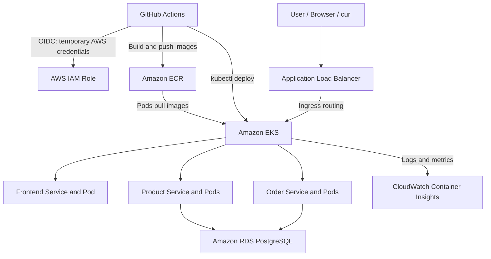

# E-Commerce DevOps Platform

A containerized e-commerce application deployed on AWS using Terraform, Amazon EKS, Kubernetes, GitHub Actions, Amazon ECR, Amazon RDS PostgreSQL, and CloudWatch.

The application has three services:

* **Frontend** - public dashboard
* **Product service** - product API
* **Order service** - order API

Product and Order use a private PostgreSQL database in Amazon RDS.

## Architecture



## Platform components

| Component                     | Purpose                                                        |
| ----------------------------- | -------------------------------------------------------------- |
| Amazon VPC                    | Network boundary for EKS, RDS, subnets, and security groups    |
| Public subnets                | Host the public Application Load Balancer and EKS worker nodes |
| Private subnets               | Host the private RDS PostgreSQL instance                       |
| Amazon EKS                    | Runs the Kubernetes workloads                                  |
| Amazon ECR                    | Stores Frontend, Product, and Order container images           |
| Application Load Balancer     | Public application endpoint with path-based routing            |
| Amazon RDS PostgreSQL         | Private database used by Product and Order                     |
| Terraform                     | Provisions and manages AWS infrastructure                      |
| GitHub Actions                | Runs infrastructure and application deployment pipelines       |
| GitHub OIDC                   | Provides temporary AWS credentials without access keys         |
| CloudWatch Container Insights | Collects EKS logs and infrastructure metrics                   |
| Horizontal Pod Autoscaler     | Scales Product and Order Pods from CPU usage                   |

All application resources run in the Kubernetes namespace `ecommerce`.

```bash
kubectl get all -n ecommerce
```

## Run locally

```bash
cp .env.example .env
docker compose up -d --build
```

Verify the local services:

```bash
curl -f http://localhost:5001/health
curl -f http://localhost:5003/health
curl -f http://localhost:5500/
```

Stop the local environment:

```bash
docker compose down -v
```

## Accessing the deployed application

The application is publicly exposed through an AWS Application Load Balancer.

Get the current load balancer URL:

```bash
ALB=$(kubectl get ingress ecommerce-ingress -n ecommerce \
  -o jsonpath='{.status.loadBalancer.ingress[0].hostname}')

echo "http://$ALB"
```

Get products:

```bash
curl -i "http://$ALB/products" \
  -H "Authorization: Bearer my-demo-token"
```

Create a product:

```bash
curl -i -X POST "http://$ALB/products" \
  -H "Authorization: Bearer my-demo-token" \
  -H "Content-Type: application/json" \
  -d '{"name":"Laptop","price":55000,"stock":10}'
```

## CI/CD workflow

The repository has two manually triggered GitHub Actions workflows. Once started, each workflow runs automatically without manual AWS login or deployment steps.

### Infrastructure CI/CD

The **Infra CI/CD** workflow:

1. Authenticates to AWS using GitHub OIDC.
2. Runs `terraform fmt -check`.
3. Initializes Terraform and validates the configuration.
4. Generates a Terraform plan.
5. Applies the approved plan.

Terraform provisions:

* VPC, internet gateway, public and private subnets
* Security groups and route tables
* EKS cluster and managed node group
* ECR repositories
* RDS PostgreSQL and database subnet group
* IAM roles and EKS access configuration

### Application CI/CD

The **Application CI/CD** workflow:

1. Builds and starts all services using Docker Compose.
2. Verifies Product, Order, and Frontend health endpoints locally.
3. Authenticates to AWS using GitHub OIDC.
4. Builds Frontend, Product, and Order images.
5. Tags images with the Git commit SHA and pushes them to Amazon ECR.
6. Connects to EKS using `kubectl`.
7. Creates or updates Kubernetes secrets.
8. Applies Kubernetes Deployments, Services, HPA, and Ingress manifests.
9. Updates Deployment images and waits for successful rollout.

## Security controls

* GitHub Actions uses **OIDC** to assume an AWS IAM role. No long-lived AWS access keys are stored in GitHub.
* `TF_VAR_db_password` and `API_TOKEN` are stored as GitHub Actions Secrets and are not committed to the repository.
* The deployment workflow creates the `ecommerce-secrets` Kubernetes Secret. Product and Order Pods read database URLs and API tokens from this Secret.
* RDS is private, has encrypted storage, and is not publicly accessible.
* The RDS security group allows PostgreSQL traffic only from inside the VPC.
* Kubernetes Services are internal by default. The Application Load Balancer is the public entry point.
* Container images run as a non-root user with UID `10001`.
* Amazon ECR image scanning is enabled on push.
* EKS access is controlled through AWS IAM access entries.
* SonarQube analysis is enabled for code-quality and security findings.

## Key technical decisions

| Decision                      | Reason                                                                    |
| ----------------------------- | ------------------------------------------------------------------------- |
| Terraform                     | Provides repeatable infrastructure provisioning                           |
| Amazon EKS                    | Kubernetes provides Deployments, self-healing, Services, Ingress, and HPA |
| Amazon ECR                    | Keeps application container images in a private AWS registry              |
| ALB Ingress Controller        | Provides one public entry point and path-based routing                    |
| Private RDS                   | Keeps the database inaccessible from the public internet                  |
| GitHub OIDC                   | Avoids storing AWS access keys in GitHub                                  |
| HPA with Metrics Server       | Scales Product and Order Pods based on CPU usage                          |
| CloudWatch Container Insights | Provides centralized logs and EKS metrics                                 |
| Docker Compose                | Provides local validation before cloud deployment                         |

## Autoscaling and load test

Product and Order use Horizontal Pod Autoscalers.

| Service | Minimum Pods | Maximum Pods | CPU target |
| ------- | -----------: | -----------: | ---------: |
| Product |            1 |            3 |        60% |
| Order   |            1 |            3 |        60% |

The scale-down stabilization window is set to 30 seconds for a faster demo.

```bash
kubectl get hpa -n ecommerce
kubectl top pods -n ecommerce
```

Create load against the Product service:

```bash
kubectl create deployment load-generator \
  -n ecommerce \
  --image=busybox:1.36 \
  -- /bin/sh -c 'while true; do wget -q -O- http://product:5001/products >/dev/null; done'

kubectl scale deployment load-generator -n ecommerce --replicas=10
```

Watch HPA and Pods scale:

```bash
kubectl get hpa -n ecommerce -w
kubectl get pods -n ecommerce -w
```

Remove the load after the test:

```bash
kubectl delete deployment load-generator -n ecommerce
```

Expected behavior: the Product HPA increases replicas from 1 up to 3 when CPU demand rises. After load is removed, it scales back down.

## Self-healing test

Kubernetes Deployments maintain the required number of replicas.

```bash
kubectl get pods -n ecommerce -l app=product
kubectl delete pod -n ecommerce <PRODUCT_POD_NAME>
kubectl get pods -n ecommerce -l app=product -w
```

Expected behavior: Kubernetes creates a replacement Product Pod automatically.

## Database

| Property           | Value                     |
| ------------------ | ------------------------- |
| Instance           | `ecommerce-demo-postgres` |
| Engine             | PostgreSQL                |
| Database           | `ecommerce`               |
| Port               | `5432`                    |
| Public access      | Disabled                  |
| Storage encryption | Enabled                   |

The database is only reachable from inside the VPC.

To connect from a temporary Pod inside the cluster:

```bash
kubectl run postgres-client -n ecommerce --rm -it --restart=Never \
  --image=postgres:16 -- \
  psql "host=<RDS_ENDPOINT> port=5432 dbname=ecommerce user=app sslmode=require" -W
```

Useful SQL commands:

```sql
\dt
SELECT * FROM products;
SELECT * FROM orders;
```

## Logging and monitoring

CloudWatch Observability is enabled through the `amazon-cloudwatch-observability` EKS add-on with EKS Pod Identity.

It collects:

* Application container logs
* Cluster, node, Pod, and container metrics
* CPU and memory usage
* Pod status and restart information

Verify the monitoring components:

```bash
kubectl get pods -n amazon-cloudwatch
```

Verify the add-on:

```bash
aws eks describe-addon \
  --cluster-name ecommerce-demo \
  --addon-name amazon-cloudwatch-observability \
  --region ap-south-1 \
  --query "addon.status" \
  --output text
```

CloudWatch log groups for the cluster include:

```text
/aws/containerinsights/ecommerce-demo/application
/aws/containerinsights/ecommerce-demo/dataplane
/aws/containerinsights/ecommerce-demo/host
/aws/containerinsights/ecommerce-demo/performance
```

Useful troubleshooting commands:

```bash
kubectl logs -n ecommerce deployment/product --tail=100
kubectl logs -n ecommerce deployment/order --tail=100
kubectl get events -n ecommerce --sort-by=.lastTimestamp
kubectl get pods -n ecommerce -w
```

For this demo, a short CloudWatch log retention period such as 7 days is recommended to control cost.

## Future DevOps improvements

1. **Terraform state and deployment safety** - create backend resources through a bootstrap module, enable state versioning and locking, require plan approval, and run drift detection.

2. **Node autoscaling** - add Karpenter or Cluster Autoscaler so EKS adds nodes when HPA-created Pods cannot fit on existing worker nodes.

3. **Security hardening** - move worker nodes to private subnets and use AWS Secrets Manager with External Secrets instead of manually managed Kubernetes Secrets.

4. **Monitoring and alerting** - add CloudWatch alarms, EKS control-plane logs, structured JSON application logs, Prometheus, Grafana, and Alertmanager.

5. **High availability and recovery** - enable Multi-AZ RDS, longer backup retention, deletion protection, Pod Disruption Budgets, and topology-spread rules.

6. **Safer deployments** - introduce development, staging, and production environments, approval before production deployment, rollback procedures, and GitOps with Argo CD.

7. **Cost management** - add AWS Budgets, billing alerts, ECR retention policies, rightsizing reviews, and a manually approved Terraform destroy workflow for non-production environments.


### Validation and code quality

- The Application CI/CD workflow runs Docker Compose smoke checks for the Product, Order, and Frontend health endpoints before deployment.
- SonarQube analysis is enabled for repository code-quality and security findings.
- A dedicated `pytest` unit-test suite was not added within the four-hour exercise timebox. The next improvement would be to run unit tests before Docker Compose smoke checks and use a SonarQube Quality Gate to block failed checks.

## Known limitations

- `DELETE /orders/{id}` is not implemented yet and returns `405 Method Not Allowed`.
- Dedicated Python unit tests are not implemented yet; current automated validation uses Docker Compose smoke checks.


## What was demonstrated

* Public application access through an AWS Application Load Balancer
* Dockerized Frontend, Product, and Order services
* Terraform-managed AWS infrastructure
* GitHub OIDC-based AWS authentication
* Container images pushed to Amazon ECR
* Kubernetes deployment rollout on Amazon EKS
* Pod self-healing after Pod deletion
* HPA scale-out from 1 to 3 Product replicas under load
* Automatic scale-down after load removal
* Private RDS PostgreSQL connectivity
* CloudWatch logs and Container Insights metrics
